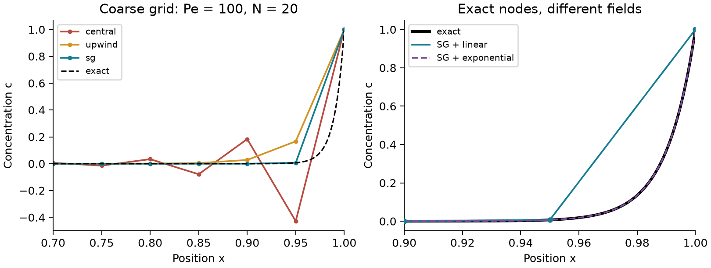
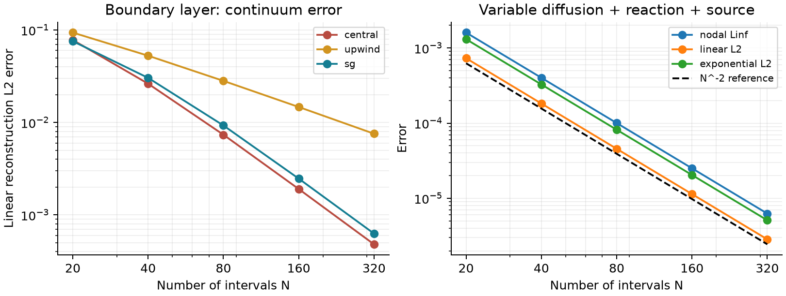

# LayerLens

[](https://github.com/racostacme-come/layerlens/actions/workflows/checks.yml)

**Exact nodal values do not necessarily resolve a boundary layer.** This original
Python verification laboratory compares Scharfetter–Gummel exponential fitting,
central differences and upwinding, separating algebraic balance, nodal error and
reconstructed continuum error.

Read the four-page [academic paper](paper/paper.pdf), its [LaTeX source](paper/paper.tex),
and [compilation instructions](paper/README.md).



## Recorded results

For `v=1`, `D=0.01`, `c(0)=0`, `c(1)=1` and 20 uniform intervals:

| Scheme | Minimum nodal value | Maximum nodal error | Linear reconstruction L2 error |
| --- | ---: | ---: | ---: |
| Central | -0.42857 | 0.43531 | 0.07795 |
| Upwind | 0.00000 | 0.15993 | 0.09376 |
| Exponentially fitted (SG) | 0.00000 | 5.20e-18 | 0.07568 |

SG exponential reconstruction instead gives L2 error `1.27e-17` for this
homogeneous constant-coefficient problem. That exactness does **not** generalize
to a variable-diffusion problem with source and reaction: the manufactured test
gives final nodal order **1.99998**, and exponential reconstruction has a larger
field error than linear interpolation there. These are
[recorded numerical results](examples/results/metrics.json), not physical validation.
Central differences even have smaller linear-field error than SG on some refined
grids; schemes should not be ranked by nodal error alone.

## Install and run

Requires Python 3.11 or newer. Pip installs NumPy, SciPy and Matplotlib.

```sh
python -m venv .venv
# Linux/macOS: source .venv/bin/activate
# PowerShell: .\.venv\Scripts\Activate.ps1
python -m pip install -e ".[dev]"
layerlens solve --cells 20 --peclet 100 --scheme sg --output output/profile.csv
layerlens demo --output output/demo
python scripts/check_samples.py
```

The `solve` CLI uses `L=D=1`, `v=--peclet`, and boundaries `(0,1)`. Its concentration
matches cases with the same global Peclet number, but flux has the `D=1` scale.
Signed Peclet numbers and zero drift are supported. `demo` uses the paper's
parameters and writes CSV, JSON metrics, figures, and dependency versions.

## Equations and algorithm

The nondimensional boundary-value problem is

$$J'+rc=f,\qquad J=vc-Dc',\qquad c(0)=c_L,\quad c(L)=c_R.$$

Velocity is constant, diffusion positive and reaction nonnegative. Nodes may be
nonuniform. With edge width `h_i`, frozen edge diffusion `D_i` and `P_i=v*h_i/D_i`,
the homogeneous exact edge flux is

$$J_i=a_ic_i-b_ic_{i+1},\quad a_i=\frac{D_i}{h_i}B(-P_i),\quad
b_i=\frac{D_i}{h_i}B(P_i),\quad B(z)=\frac{z}{e^z-1},\quad B(0)=1.$$

Interior dual-cell widths are `w_i=(h[i-1]+h[i])/2`. Lumped source/reaction
integration yields the tridiagonal system

$$-a_{i-1}c_{i-1}+(a_i+b_{i-1}+r_iw_i)c_i-b_ic_{i+1}=f_iw_i.$$

1. Validate inputs and evaluate Bernoulli functions with a series near zero and
   negative exponentials at large magnitude.
2. Assemble three bands and move Dirichlet terms into the right-hand side.
3. Use SciPy's pivoted banded direct solve, with O(N) work and storage.
4. Recover shared edge fluxes, interior residuals and the net balance defect.
5. Name a reconstruction before measuring continuum error.

For constant velocity `a_i-b_i=v`: the fitted matrix has nonpositive
off-diagonals, row diagonal dominance and boundary anchoring. In exact arithmetic
it preserves positivity for nonnegative sources and boundary data; a positive
source need not preserve the boundary maximum. Central differencing loses its
off-diagonal sign condition at edge `|P|>2`. No clipping conceals oscillations.

Python owns the implementation; SciPy supplies compiled linear algebra. A custom
C++ core is not warranted by a demonstrated bottleneck here. Other projects in
the series use C++17/Python cores.

## Python API

```python
import numpy as np
from layerlens import solve

x = np.linspace(0.0, 1.0, 81)
result = solve(
    x,
    velocity=2.0,
    diffusivity=1.0 + (x[:-1] + x[1:]) / 2,
    reaction=0.7,
    source=np.ones(len(x) - 2),
    boundary=(1.0, 2.0),
    scheme="sg",
)
field = result.reconstruct(np.linspace(0, 1, 1001), kind="linear")
print(result.balance_error, max(abs(result.residual)))
```

`solve` requires at least three strictly increasing finite nodes. `diffusivity`
is scalar or length `len(x)-1`; `source` and `reaction` are scalar or length
`len(x)-2`. Velocity is scalar and `boundary` holds two finite values. Schemes
are `sg`, `central` and `upwind`. Returned arrays are independent read-only
snapshots: one flux per edge and one residual per interior dual cell.

`reconstruct(points, kind="linear"|"exponential")` accepts scalar or array
queries in the closed domain, with no extrapolation. Exponential reconstruction
uses the frozen homogeneous edge problem and is generally approximate when
source, reaction or variable continuum diffusion are present. `bernoulli` and
`layer_profile` are public broadcasting helpers. Invalid inputs raise `ValueError`;
numerical overflow may raise `FloatingPointError`, while a singular band system
raises `numpy.linalg.LinAlgError`.

## Validation and reproduction

The local run passed **42 tests**, Ruff lint/format, wheel and source distribution
builds, installed-wheel tests and sample reproduction. The four-page Tectonic
paper passed page-count, overfull-box and undefined-reference checks; every page
was visually inspected. CI repeats numerical checks on Ubuntu/Python 3.11 and
Windows/Python 3.14, and independently compiles with pdfLaTeX. The badge links
to actual executed CI status.

```sh
python -m pytest -q
ruff check .
ruff format --check .
python scripts/check_samples.py
python -m build
python paper/build.py --engine pdflatex
```

Tests cover exact diffusion with a source, discontinuous diffusion resistances,
signed drift, graded meshes, positive sources/reaction, conservation,
manufactured convergence, central oscillations, invalid inputs and CLI output.
The manufactured solution is `c=1+x+sin(pi*x)`, with `v=2`, `D=1+x`, `r=0.7` and
`f=c'-(1+x)c''+0.7*c`. Its finest nodal error is `6.2593e-6` at 320 intervals.



All figures and tables are generated by `layerlens demo`. The committed
[environment record](examples/results/environment.json) identifies sample
package versions. Reproduction compares JSON metrics at `rtol=5e-7`, `atol=2e-12`;
roundoff-sensitive residual/balance metrics allow `atol=2e-10`. PNG byte equality
across library versions is not required. Field L2 norms use 32-point per-edge
Gauss quadrature; doubling to 64 changes the coarse SG linear-field norm by
`1.11e-16`. The paper's [validation manifest](paper/validation.json) hashes its
source, generator, numerical implementation, data and figures. Rebuild after
changing inputs. Real feature/validation branches and normal merges are retained.

## Limitations

- Stationary scalar 1D transport with constant velocity and two Dirichlet values;
  no transient, nonlinear, coupled or multidimensional model.
- Midpoint-frozen diffusion and lumped source/reaction approximate the continuum
  problem. The measured second-order rate is for one smooth uniform-grid test;
  abrupt grading and jumps need separate analysis.
- Residuals measure discrete defects, not continuum error. Net balance covers
  interior dual cells and excludes endpoint half-cells.
- Exponentially tiny fluxes suffer cancellation: small absolute residuals do not
  imply relative flux accuracy. Large Peclet numbers can underflow the downwind
  coefficient; strong contrasts or grading can impair conditioning.
- No condition-number certificate or rigorous error bound. Synthetic mathematical
  verification provides no experimental physical validation.

## Origins, public references and license

The local CFD course's numerical-approximation and scheme-analysis topics
motivated the question; software-lab practices motivated reproducibility and
packaging. Only concepts were consulted. No course files, solutions, exams or
private datasets are included. Originality is in this implementation and
comparative experiment, not in the established numerical method.

- M. Bessemoulin-Chatard, *A finite volume scheme for convection-diffusion
  equations with nonlinear diffusion derived from the Scharfetter-Gummel scheme*,
  [arXiv:1011.2299v2](https://arxiv.org/abs/1011.2299), 2012.
- K. Salari and P. Knupp, *Code Verification by the Method of Manufactured
  Solutions*, SAND2000-1444, [doi:10.2172/759450](https://doi.org/10.2172/759450), 2000.
- [SciPy banded solver API](https://docs.scipy.org/doc/scipy/reference/generated/scipy.linalg.solve_banded.html).

Original implementation, manuscript and generated figures: [MIT license](LICENSE).
